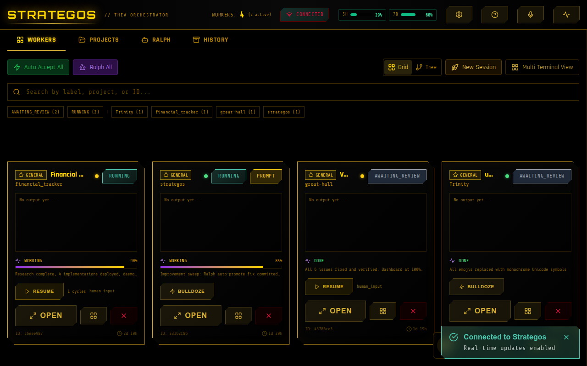

# Strategos

A web dashboard for orchestrating AI coding agents. Spawn Claude Code or Gemini CLI workers in tmux sessions, watch their terminals live, organize them into hierarchies, and let them coordinate autonomously.



## Install

```bash
git clone https://github.com/drewrad8/strategos.git
cd strategos
npm install
npm start
```

Open **http://localhost:38007**.

The client is pre-built in `client/dist/`. No build step required.

## Requirements

- Node.js 20+
- tmux
- Claude Code CLI (`npm i -g @anthropic-ai/claude-code`) or Gemini CLI

## What it does

You give workers a task. They run in isolated tmux sessions. You see their terminal output live in your browser.

Workers can be organized into hierarchies — a GENERAL spawns COLONELs who manage IMPL/TEST/RESEARCH specialists. Progress bubbles up automatically via the **Ralph protocol**: workers signal `in_progress`, `done`, or `blocked` with a completion percentage.

**Bulldoze mode** keeps workers going autonomously — when a worker completes a cycle, it gets a continuation prompt. Useful for long-running tasks where you don't want to babysit.

The dashboard shows worker cards, a tree view of hierarchies, live terminals, health monitoring, and project organization. Keyboard shortcuts for everything (press `?`).

## Spawning workers

From the UI, click "New Session" and pick a template.

From the API:

```bash
curl -X POST http://localhost:38007/api/workers/spawn-from-template \
  -H "Content-Type: application/json" \
  -d '{
    "template": "impl",
    "label": "IMPL: fix-login-bug",
    "projectPath": "/path/to/your/project",
    "task": {"description": "Fix the login timeout bug in auth.js"}
  }'
```

Templates: `research`, `impl`, `test`, `review`, `fix`, `colonel`, `general`

## Configuration

All via environment variables. The defaults work out of the box.

| Variable | Default | What it does |
|----------|---------|-------------|
| `PORT` | `38007` | Server port |
| `THEA_ROOT` | _(auto-detected)_ | Parent directory to scan for projects. Auto-derives from install location. |
| `STRATEGOS_API_KEY` | _(none)_ | Set to require API key authentication (min 16 chars) |
| `ENABLE_OLLAMA_SUMMARIES` | `false` | AI-powered worker summaries via local Ollama |

See [docs/STRATEGOS_USAGE_GUIDE.md](docs/STRATEGOS_USAGE_GUIDE.md) for the full API reference.

## Development

```bash
npm run dev    # Server on :38007, Vite HMR on :38008
npm run build  # Rebuild client
npm test       # Playwright e2e tests
```

## License

MIT
